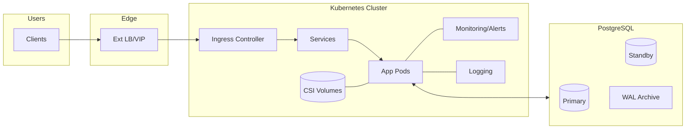
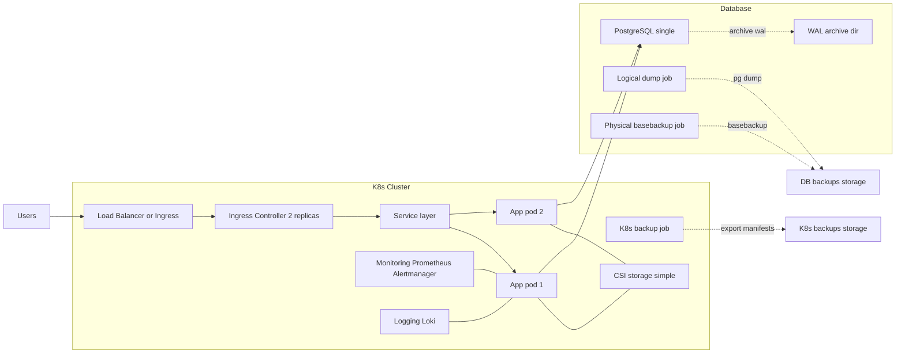
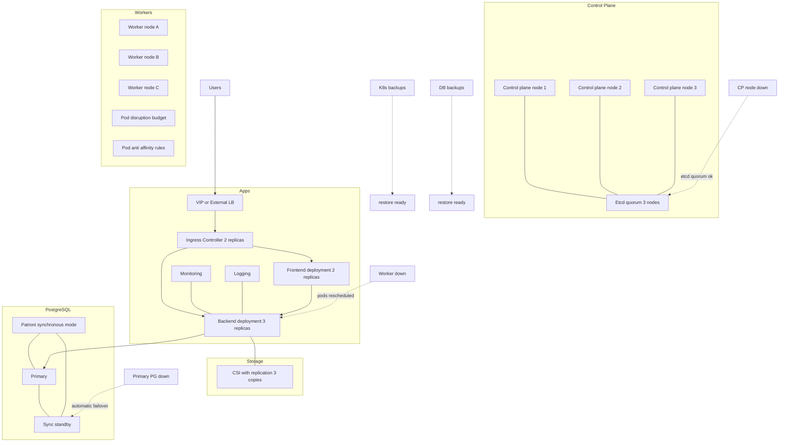
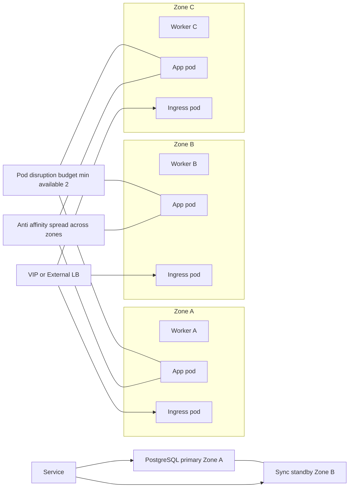
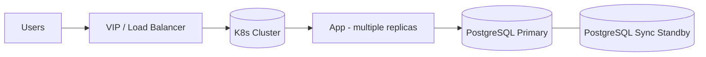
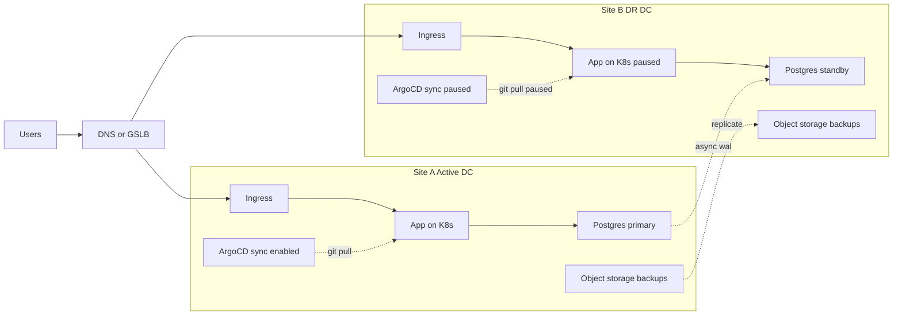
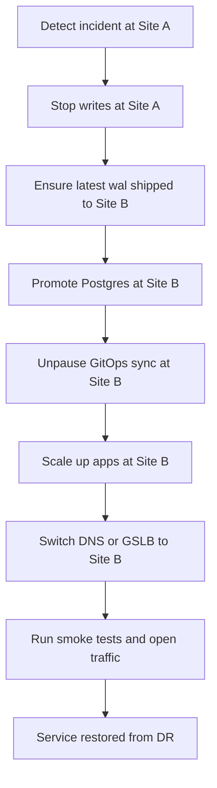
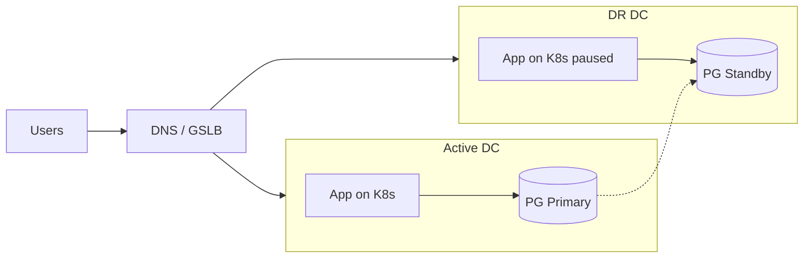

## baseline:

### Baseline — подробнее: компоненты и бэкапы

### Baseline — поток восстановления

``` mermaid
flowchart LR
  BKPK8S[K8s backups storage] --> RESTK8S[Apply manifests]
  BKPPG[DB backups storage] --> RESTDB[Restore from dump]
  WAL[WAL archive dir] --> RESTDB

  RESTK8S --> K8sReady[K8s objects created]
  RESTDB --> DBReady[Database restored]

  K8sReady --> APPStart[App rollout]
  DBReady --> APPStart
  APPStart --> OK[Smoke tests and go live]
  ```

### brief
``` mermaid
flowchart LR
  U[Users] --> LB[LB/Ingress]
  LB --> K8s[Kubernetes]
  K8s --> APP[App]
  APP --> PG[(PostgreSQL)]
```

## HA:

### HA в одном ЦОД — подробнее: контроль плейн, реплики PG, отказ:


### HA в одном ЦОД — зоны отказа и политика размещения:



### brief


## DR:

### DR два ЦОДа — подробнее: трафик, GitOps, репликация:



### DR два ЦОДа — упорядоченный фейловер:


### brief

